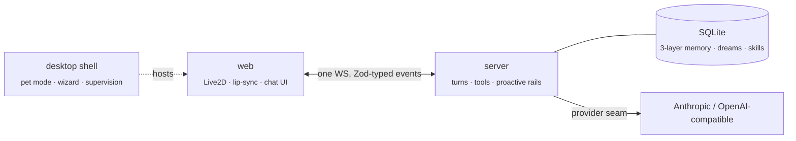

<div align="center">


# Luna

**A desktop AI companion that lives with you — she remembers, perceives, acts, and speaks.**

An LLM brain with layered memory and dreams, proactive agency, action-integrity rails, and a
code-agent capability — embodied as a Live2D avatar with lip-synced custom voice.

[](LICENSE)
[](https://bun.sh)
[](tsconfig.json)
[](packages/desktop)
[](CONTRIBUTING.md)

**English** · [简体中文](README.zh-CN.md)


[](https://github.com/Alan-Yu-2077/Luna-ts/releases/latest/download/Luna-Setup-Windows-x64.exe) &nbsp; [](https://github.com/Alan-Yu-2077/Luna-ts/releases/latest/download/Luna-macOS-arm64.dmg)

<sub>Pre-release · unsigned — Windows SmartScreen / macOS Gatekeeper warns on first run (click **Run anyway** / right-click → **Open**). <a href="https://github.com/Alan-Yu-2077/Luna-ts/releases/latest">All downloads →</a></sub>

[](https://alan-yu-2077.github.io/Luna-ts/)

</div>

---

## ✨ Features

- 🧠 **Three-layer memory + dreams** — a rolling working window, salience-scored durable turns, and
  structured long-lived facts over one SQLite file; an offline **dream cycle** consolidates the day
  into facts, diary, and distilled skills. Hybrid recall blends embeddings, keywords, recency, and a
  relevance floor so a decisively relevant old memory is never buried.
- 🌱 **Proactive agency** — she can open a conversation herself: silence-aware timing ladders,
  weather-shift and reconnect hooks, follow-up thoughts — all behind deterministic, tunable rails
  (quiet hours, outreach intensity) instead of a "message me every N minutes" loop.
- ⚡ **Streaming everything** — one WebSocket, one Zod-typed event contract shared by server and web.
  Reply tokens, tool starts/progress, memory updates all stream live; tool turns never block.
- 🛠 **Real capabilities** — web search + SSRF-guarded page reading, weather (QWeather / Open-Meteo),
  time perception, a gated code-agent (repo map, symbol search, edits), and a skills shelf she
  distills herself.
- 🎭 **Embodied** — a Live2D avatar with emotion-driven expressions, gaze follow, idle animation
  profiles, phoneme lip-sync, and a transparent always-on-top **desktop pet mode**.
- 🗣 **Your voice** — zero-setup browser TTS out of the box, or a GPT-SoVITS custom voice with no
  terminal anywhere: the wizard downloads & deploys the runtime in one click, you drag a voice pack
  in, and Luna starts + supervises the voice server herself. Drop a new pack onto the running app
  to swap voices.
- 🧙 **Guided onboarding** — a bilingual (中文/English) wizard that opens by asking which Luna you
  want: **the complete companion** (Live2D + voice, seven steps) or **just the agent core** (chat box
  only, five steps, nothing to download). Either way you get *live* key validation against the real
  vendors, drag-and-drop avatar/voice installs, and escape hatches everywhere (status-bar button,
  native `⌘,` menu, failure dialogs) so a bad config can never strand you.
- 🔒 **Local-first** — memory is a local SQLite file, keys live in a local config only, the server
  binds loopback by default. Nothing about *her* leaves your machine.

## 🚀 Quick start

```sh
git clone https://github.com/Alan-Yu-2077/Luna-ts.git
cd Luna-ts
bun run app        # installs deps → builds → packages → puts Luna.app on your Desktop → launches
```

<div align="center">
<br/>
<sub>First launch opens a bilingual guided setup — no env files, no docs required.</sub>
</div>

The only *required* thing is a chat API key (Anthropic, or any compatible gateway) — every other
step is optional and re-runnable from Settings.

Prefer the browser, or not on macOS?

```sh
bun install
cp .env.example .env   # set ANTHROPIC_API_KEY
bun run dev            # server + web at http://localhost:5173
```

<div align="center">
<table>
  <tr>
    <td align="center"><br/><sub>Voice step — one-click GPT-SoVITS deploy, drag a voice pack in, live health badge</sub></td>
    <td align="center"><br/><sub>First run — she ships with no body; you bring the avatar and the voice</sub></td>
  </tr>
</table>
</div>

## 🏗 How it fits together



Four Bun workspace packages with a one-way dependency arrow: [`protocol`](packages/protocol) (the
shared wire contract — a wire change that isn't reflected on both sides is a *compile error*),
[`server`](packages/server) (the brain; owns all state and model calls),
[`web`](packages/web) (a thin reactive view), and [`desktop`](packages/desktop) (an optional
Electron shell). The deep dive lives in [`ARCHITECTURE.md`](ARCHITECTURE.md).

## 🎬 Moments

Real conversations — she jokes, she looks things up, she reads her own codebase, she remembers.

<table>
  <tr>
    <td width="50%"></td>
    <td width="50%"></td>
  </tr>
  <tr>
    <td align="center"><sub><b>She has a sense of humor.</b> A running fries bit, played straight — mood pill flips to <i>Playful</i>.</sub></td>
    <td align="center"><sub><b>She actually helps.</b> Does the grade math, and gets the emotional register right ("the cutoff itself, not your nerves").</sub></td>
  </tr>
  <tr>
    <td></td>
    <td></td>
  </tr>
  <tr>
    <td align="center"><sub><b>She builds on herself.</b> Saves a skill "for a version of myself I haven't met yet," then uses it minutes later (<code>ran a command → shell exit 0</code>).</sub></td>
    <td align="center"><sub><b>She can read her own code.</b> Searches the repo (<code>103 of 103 matches</code>) to answer how her own skill system works.</sub></td>
  </tr>
</table>

## 📚 Documentation

| Doc | What it covers |
| --- | --- |
| [`docs/SETUP.md`](docs/SETUP.md) | Bring-your-own model & voice, step by step (the wizard does this for you) |
| [`ARCHITECTURE.md`](ARCHITECTURE.md) | The structural map: packages, wire contract, memory, tools, proactive rails |
| [`ROADMAP.md`](ROADMAP.md) | Where things are heading, by theme |
| [`docs/history/DEVELOPMENT.md`](docs/history/DEVELOPMENT.md) | The full per-version engineering log (130+ entries) |
| [`.env.example`](.env.example) | Every configuration knob, documented |
| [`CONTRIBUTING.md`](CONTRIBUTING.md) | Dev workflow, tests, conventions |

## 🧪 Development

```sh
bun test                                  # the whole suite, all packages
bun run --cwd packages/server tsc --noEmit  # per-package typecheck (server/web/desktop/protocol)
```

Tests live next to the code (`*.test.ts`), the wire contract is `as`-free, and every risky feature
lands behind a default-off env flag before its default flips. The server binds
**loopback (`127.0.0.1`) by default**; set `LUNA_BIND_HOST=0.0.0.0` only on a trusted network.

## 🤝 Contributing

Issues and PRs are welcome — [`CONTRIBUTING.md`](CONTRIBUTING.md) has the workflow, and
[`ROADMAP.md`](ROADMAP.md) lists directions where help is wanted. Good first contribution:
per-model Live2D expression presets (see the honest limitation note in
[`docs/SETUP.md`](docs/SETUP.md)).

## 📄 License

[MIT](LICENSE), with one carve-out: the vendored **Live2D Cubism Core** runtime
(`packages/web/public/live2dcubismcore.min.js`) is proprietary to Live2D Inc. and governed by its
own license. See [`THIRD_PARTY_LICENSES`](THIRD_PARTY_LICENSES).

## ❤️ Acknowledgements

[GPT-SoVITS](https://github.com/RVC-Boss/GPT-SoVITS) ·
[pixi-live2d-display](https://github.com/guansss/pixi-live2d-display) ·
[Live2D Cubism](https://www.live2d.com/) ·
[Bun](https://bun.sh) · [Electron](https://electronjs.org) ·
weather by [QWeather](https://dev.qweather.com/) & [Open-Meteo](https://open-meteo.com/) ·
search by [Tavily](https://tavily.com/)
