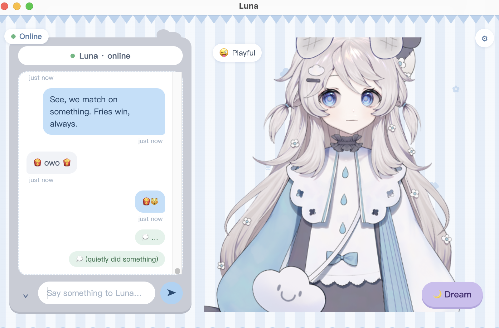
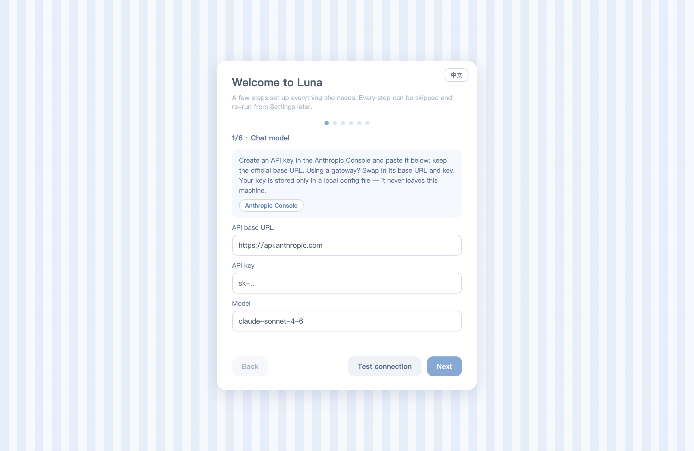
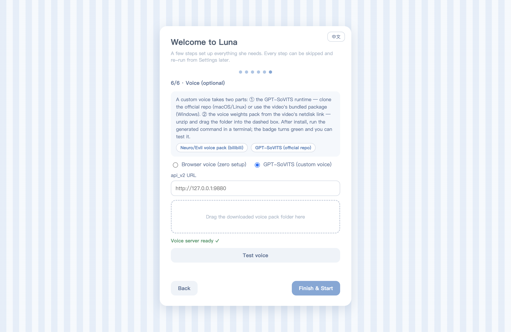
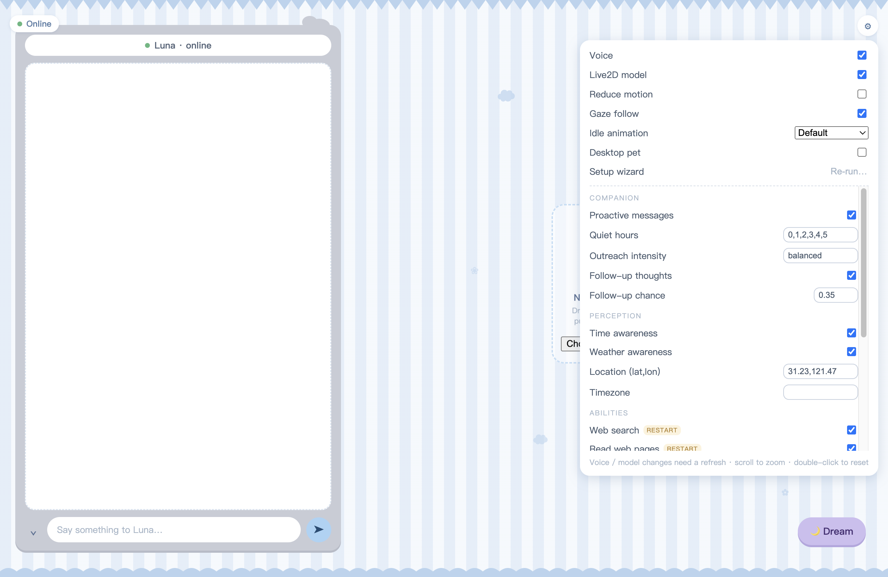
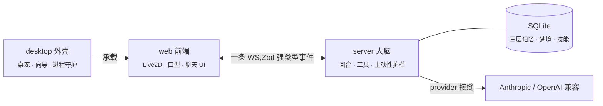
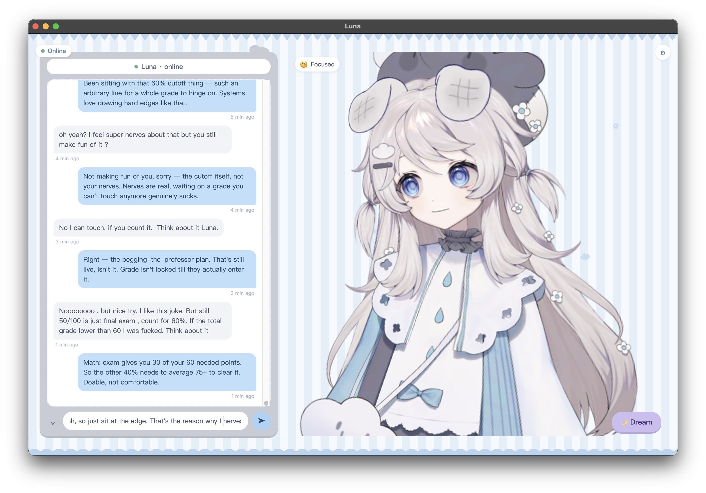
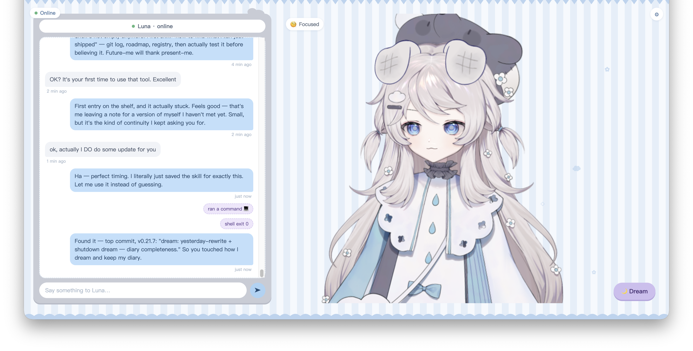

<div align="center">


# Luna

**住在你桌面上的 AI 伙伴——她有记忆、有感知、能做事、会说话。**

一颗 LLM 大脑:分层记忆与梦境沉淀、主动性、行动完整性护栏、代码能力——
以 Live2D 立绘为身体,配上口型同步的自定义语音。

[](LICENSE)
[](https://bun.sh)
[](tsconfig.json)
[](packages/desktop)
[](CONTRIBUTING.md)

[English](README.md) · **简体中文**



[](https://github.com/Alan-Yu-2077/Luna-ts/releases/latest/download/Luna-Setup-Windows-x64.exe) &nbsp; [](https://github.com/Alan-Yu-2077/Luna-ts/releases/latest/download/Luna-macOS-arm64.dmg)

<sub>预发布 · 未签名——Windows SmartScreen / macOS Gatekeeper 首次运行会警告(点“仍要运行” / 右键→“打开”)。<a href="https://github.com/Alan-Yu-2077/Luna-ts/releases/latest">全部下载 →</a></sub>

[](https://alan-yu-2077.github.io/Luna-ts/)

</div>

---

## ✨ 特性

- 🧠 **三层记忆 + 梦境** —— 滚动工作记忆、按显著性沉淀的耐久对话层、结构化长期事实,全部落在
  一个本地 SQLite 文件;离线**梦境循环**把一天消化成事实、日记和提炼出的技能。混合召回融合
  embedding 语义、关键词、新近度,并带"相关性楼层"——真正相关的老记忆不会被新消息埋掉。
- 🌱 **主动性** —— 她会主动开口:静默感知的时间阶梯、天气突变与重连钩子、追想式跟进,全部跑在
  确定性的、可调的护栏上(免打扰时段、主动强度),而不是"每 N 分钟骚扰一次"的定时器。
- ⚡ **全链路流式** —— 一条 WebSocket、一份服务端与前端共享的 Zod 强类型事件契约。回复逐 token、
  工具启动/进度、记忆更新实时推送;工具回合永不阻塞。
- 🛠 **真实能力** —— 联网搜索 + SSRF 防护的网页阅读、天气(和风 / Open-Meteo)、时间感知、
  带能力闸门的代码代理(仓库地图、符号检索、编辑),以及她自己蒸馏的技能架。
- 🎭 **有身体** —— Live2D 立绘:情绪驱动表情、视线跟随、待机动画方案、音素级口型同步,以及
  透明置顶的**桌宠模式**。
- 🗣 **你的声音** —— 开箱即用浏览器语音;要定制音色也全程不用开终端:向导一键下载并部署
  GPT-SoVITS,拖入音色权重包,语音服务由 Luna 自己启动并看护;运行中把新音色包拖到界面上即可换声。
- 🧙 **引导式上手** —— 六步中英双语向导:每把 key 都对真实服务商**在线验证**、立绘与音色包
  拖入即装,并且处处有退路(状态栏按钮、原生 `⌘,` 菜单、失败弹窗)——配坏了永远一键回到向导。
- 🔒 **本地优先** —— 记忆是本地 SQLite,密钥只存本机配置文件,服务默认只绑回环地址。
  属于*她*的一切都不出你的电脑。

## 🚀 快速开始

```sh
git clone https://github.com/Alan-Yu-2077/Luna-ts.git
cd Luna-ts
bun run app        # 装依赖 → 构建 → 打包 → Luna.app 出现在桌面 → 自动启动
```

<div align="center">
<br/>
<sub>首次启动即进入中英双语引导向导——不用碰配置文件,不用翻文档。</sub>
</div>

唯一*必填*的是聊天 API key(Anthropic 或任意兼容网关)——其余每一步都可跳过,以后在设置里随时重开。

想在浏览器里跑,或者不在 macOS:

```sh
bun install
cp .env.example .env   # 填 ANTHROPIC_API_KEY
bun run dev            # server + web,http://localhost:5173
```

<div align="center">
<table>
  <tr>
    <td align="center"><br/><sub>语音步骤——一键部署 GPT-SoVITS,拖入音色包,徽章实时报告语音服务状态</sub></td>
    <td align="center"><br/><sub>首启界面——她不自带身体;立绘和声音由你来定</sub></td>
  </tr>
</table>
</div>

## 🏗 架构一图流



四个 Bun workspace 包,依赖箭头单向:[`protocol`](packages/protocol)(共享线上契约——两端不同步
的改动是*编译错误*而不是运行时漂移)、[`server`](packages/server)(大脑,持有全部状态与模型调用)、
[`web`](packages/web)(轻薄响应式视图)、[`desktop`](packages/desktop)(可选 Electron 外壳)。
深入细节见 [`ARCHITECTURE.md`](ARCHITECTURE.md)。

## 🎬 一些瞬间

真实对话——她会玩梗、会联网查、会翻自己的代码、会记住。

<table>
  <tr>
    <td width="50%"></td>
    <td width="50%"></td>
  </tr>
  <tr>
    <td align="center"><sub><b>她有幽默感。</b>一个薯条梗一本正经地接住了——情绪泡翻成 <i>Playful</i>。</sub></td>
    <td align="center"><sub><b>她是真的在帮忙。</b>算清了分数,还把情绪落点接对了("是那条分数线本身,不是你的紧张")。</sub></td>
  </tr>
  <tr>
    <td></td>
    <td></td>
  </tr>
  <tr>
    <td align="center"><sub><b>她在自我叠加。</b>存下一条技能"留给一个我还没遇见的自己",几分钟后就用上了(<code>ran a command → shell exit 0</code>)。</sub></td>
    <td align="center"><sub><b>她能读自己的代码。</b>搜遍仓库(<code>103 of 103 matches</code>)来回答自己的技能系统是怎么运作的。</sub></td>
  </tr>
</table>

## 📚 文档

| 文档 | 内容 |
| --- | --- |
| [`docs/SETUP.md`](docs/SETUP.md) | 自带模型与语音的手动步骤(向导会替你做这些) |
| [`ARCHITECTURE.md`](ARCHITECTURE.md) | 结构地图:包、线上契约、记忆、工具、主动性护栏 |
| [`ROADMAP.md`](ROADMAP.md) | 按主题的方向图 |
| [`docs/history/DEVELOPMENT.md`](docs/history/DEVELOPMENT.md) | 完整逐版本工程日志(130+ 条) |
| [`.env.example`](.env.example) | 每一个配置项,带注释 |
| [`CONTRIBUTING.md`](CONTRIBUTING.md) | 开发流程、测试、约定 |

## 🧪 开发

```sh
bun test                                    # 全包测试套件
bun run --cwd packages/server tsc --noEmit  # 按包类型检查(server/web/desktop/protocol)
```

测试与代码同目录(`*.test.ts`),线上契约零 `as` 断言,每个高风险特性都先躲在默认关闭的
env 开关后面、验证充分才翻默认。服务默认绑定**回环地址(`127.0.0.1`)**;只在可信网络上
设置 `LUNA_BIND_HOST=0.0.0.0`。

## 🤝 参与

欢迎 Issue 和 PR——流程见 [`CONTRIBUTING.md`](CONTRIBUTING.md),[`ROADMAP.md`](ROADMAP.md) 列了
需要帮手的方向。不错的第一个贡献:按模型的 Live2D 表情预设
(见 [`docs/SETUP.md`](docs/SETUP.md) 里如实写明的局限)。

## 📄 许可

[MIT](LICENSE),唯一例外:随包分发的 **Live2D Cubism Core** 运行时
(`packages/web/public/live2dcubismcore.min.js`)为 Live2D Inc. 专有,受其自身许可约束。
详见 [`THIRD_PARTY_LICENSES`](THIRD_PARTY_LICENSES)。

## ❤️ 致谢

[GPT-SoVITS](https://github.com/RVC-Boss/GPT-SoVITS) ·
[pixi-live2d-display](https://github.com/guansss/pixi-live2d-display) ·
[Live2D Cubism](https://www.live2d.com/) ·
[Bun](https://bun.sh) · [Electron](https://electronjs.org) ·
天气数据 [和风天气](https://dev.qweather.com/) & [Open-Meteo](https://open-meteo.com/) ·
搜索 [Tavily](https://tavily.com/)
